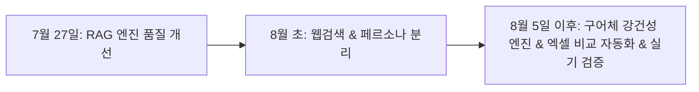

# chatbot_demo_v2 8월 이후 작업 정리 보고서

> **기준 시점**: 2026-08-05 이후 ~ 2026-08-18 (최신 통합 커밋 `08/18`)  
> **관련 문서**: [2차_개선_보고서.md](2차_개선_보고서.md) · [docs/파이프라인_노드_학습노트.md](docs/파이프라인_노드_학습노트.md) · [prompts/persona/README.md](prompts/persona/README.md)

---

## 1. 개요 및 배경

7월 27일 완료된 **2차 품질 개선(30초 롤백 오탐 제거, 근거 3등급 판정, FAQ 시맨틱 매칭 등)** 이후, 8월 5일을 전후하여 **사용자 체감 응대 품질 고도화, 구어체/오타 강건성 확보, 웹 검색 연동, 엑셀 비교 자동화** 작업이 진행되었습니다.

---

## 2. 8월 5일 이후 핵심 작업 내역

### ① 구어체 및 오타 강건성 강화 엔진 구축 (`robustness_tool/`)
사용자가 채팅창에 입력하는 비정형 구어체, 줄임말, 자모 오타를 전처리하고 질의를 최적화하는 도구를 구축했습니다.

* **자소 분해 기반 오타 교정**:
  * `decompose_hangul()` 함수를 통한 초성/중성/종성 단위 자모 분해 및 편집거리 기반 고속 오타 보정.
* **도메인 동의어 사전 매핑 ([robustness_tool/synonyms.json](robustness_tool/synonyms.json))**:
  * 단일어 사전 (`스쿨넷`, `AP`, `공유기`, `MDM` 등) 및 복합어 사전 매핑.
* **구어체 감지 및 LLM 질의 정규화 파이프라인**:
  * 문맥 기반 맞춤형 쿼리 재작성 (`robustness_tool/core.py`, `tool.py`).
* **검증 테스트**: [tests/test_robustness.py](tests/test_robustness.py) 회귀 테스트 구축.

---

### ② 독립 답변 페르소나 및 응답 정책 모듈화 ([prompts/persona/](prompts/persona/README.md))
기존의 RAG/FAQ 합성 프롬프트(`composer_rag.md`, `composer_faq.md`)와 분리하여 말투와 응답 가이드라인을 독립적으로 관리할 수 있는 모듈을 구성했습니다.

* **[persona.md](prompts/persona/persona.md)**: 전문 IT 상담관 톤앤매너 설정 (공감 표현, 친절하고 명확한 어조).
* **[response_policy.md](prompts/persona/response_policy.md)**: 두괄식 결론 제시, 불필요한 서론 생략, 마크다운 가독성 정책.
* **[response_examples.md](prompts/persona/response_examples.md)**: 모범 질의응답 Few-shot 예시 제공.
* **유연한 설정**: `PERSONA_PROMPTS_ENABLED` 환경변수로 On/Off 가능하며, 서버 재시작 없는 **핫리로드** 지원.

---

### ③ 엑셀 기반 질의응답 자동 비교 및 채점 도구 ([scripts/fill_compare_excel.py](scripts/fill_compare_excel.py))
실제 업무 시나리오 기반의 질의응답을 대량으로 검증하기 위한 엑셀 자동화 도구를 개발했습니다.

* **기능**:
  * `무선망_개선RAG_비교.xlsx` 파일을 읽어 개선된 RAG + 페르소나 프롬프트를 일괄 적용.
  * 생성된 답변과 근거 문서를 엑셀 시트에 자동 기입하여 모델 간/버전 간 품질 비교 시간 대폭 단축.

---

### ④ 실제 웹 검색 Grounding 기능 연동 (`web_search/`)
코퍼스(매뉴얼 PDF) 외의 최신 정보나 외부 지식이 필요한 질문을 처리하기 위한 웹 검색 파이프라인을 실구현했습니다.

* **[web_search/gemini_grounding.py](web_search/gemini_grounding.py)**: Gemini Search Grounding API 연동.
* **[prompts/web_domain_gate.md](prompts/web_domain_gate.md)**: 내부 코퍼스 대상 질문과 외부 웹 검색 대상 질문을 엄격히 판별하는 도메인 게이트 프롬프트 적용.

---

### ⑤ 실기 트레이스 증거 적재 및 시연/학습 매뉴얼 완비
* **실기 증거 적재 ([runtime/evidence/](runtime/evidence/))**:
  * 8월 11일 실기 질의 수행 과정에서 추출된 페이지 캡처 및 도표 이미지 적재.
* **시연 및 발표 학습 노트 ([docs/파이프라인_노드_학습노트.md](docs/파이프라인_노드_학습노트.md))**:
  * 메인그래프 14개 노드와 RAG 서브그래프 10개 노드의 1:1 동작 원리, 상태값, 플로우 시연 대본 정리.

---

## 3. 8월 5일 이후 신규/수정 파일 목록

| 분류 | 파일 경로 | 설명 |
|---|---|---|
| **강건성 도구** | [robustness_tool/core.py](robustness_tool/core.py) | 한글 자소 오타 교정 및 구어체 처리 엔진 |
| | [robustness_tool/synonyms.json](robustness_tool/synonyms.json) | IT/네트워크 도메인 단일·복합 동의어 사전 |
| | [robustness_tool/run_tool.py](robustness_tool/run_tool.py) | 강건성 테스트 실행 CLI |
| | [tests/test_robustness.py](tests/test_robustness.py) | 강건성 처리 단위 및 회귀 테스트 |
| **페르소나** | [prompts/persona/persona.md](prompts/persona/persona.md) | 상담 페르소나 톤앤매너 프롬프트 |
| | [prompts/persona/response_policy.md](prompts/persona/response_policy.md) | 두괄식 답변 및 문장 길이 정책 |
| | [prompts/persona/response_examples.md](prompts/persona/response_examples.md) | 답변 형식 Few-shot 예시 |
| | [tests/test_persona_prompts.py](tests/test_persona_prompts.py) | 페르소나 렌더링 및 핫리로드 테스트 |
| **스크립트** | [scripts/fill_compare_excel.py](scripts/fill_compare_excel.py) | 엑셀 질의응답 자동 기입/비교 도구 |
| **웹 검색** | [web_search/gemini_grounding.py](web_search/gemini_grounding.py) | Gemini 웹 검색 Grounding 구현체 |
| | [prompts/web_domain_gate.md](prompts/web_domain_gate.md) | 외부 웹 검색 진입 판정 프롬프트 |
| **문서** | [docs/파이프라인_노드_학습노트.md](docs/파이프라인_노드_학습노트.md) | 전체 24개 노드 매핑 및 시연 대본 |
| **런타임** | [runtime/evidence/](runtime/evidence/) | 8/11 실기 질의 수행 이미지/표 증거 데이터 |

---

## 4. 7월 작업 vs 8월 이후 작업 비교

| 구분 | 7월 27일 작업 (`2차_개선_보고서`) | 8월 5일 이후 작업 (`8월_이후_작업_요약`) |
|---|---|---|
| **핵심 목적** | RAG 검색 정확도 향상 & 지연 시간/비용 절감 | 사용자 입력 강건성(오타/구어체) & 응대 페르소나 & 자동화 도구 |
| **주요 개선** | 30초 롤백 오탐 제거, 근거 3등급 판정, FAQ 시맨틱 매칭 | 한글 자소 오타 교정, 동의어 매핑, 엑셀 비교 스크립트, 웹 검색 실구현 |
| **검증 방식** | 골든셋 37문항 정량 평가 (`run_eval.py`) | 구어체 회귀 테스트 (`test_robustness.py`), 엑셀 일괄 비교 |
tj