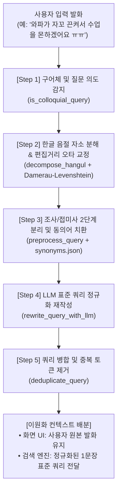
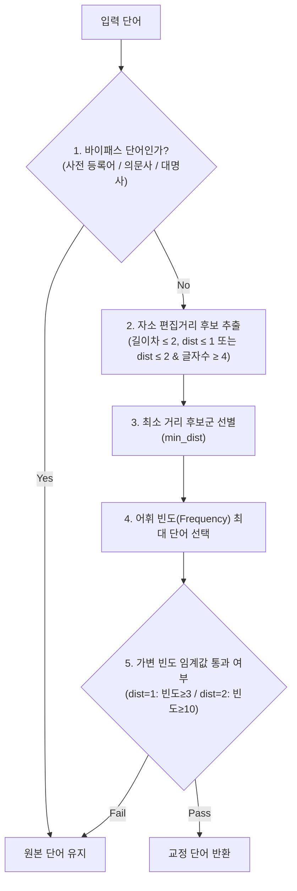

# [기술 백서] 구어체 및 한글 자소 오타 강건성 강화 엔진 (Spoken & Typo Robustness Engine)

> **문서 목적**: 본 문서는 `chatbot_demo_v2` 시스템의 핵심 질의 전처리 모듈인 **구어체 및 오타 강건성 강화 엔진(`robustness_tool/`)**의 설계 배경, 내부 아키텍처, 적용된 핵심 알고리즘, 세부 데이터 흐름, 사전 체계 및 테스트 검증 결과를 총망라하여 기술한 상세 기술 사양서입니다.

---

## 📌 Executive Summary (핵심 요약)

* **도입 배경**: 현장 사용자(교사, 교직원, 행정관)는 매뉴얼의 표준 기술 용어 대신 **비정형 구어체, 축약어, 감정 표현, 자모 오타**를 입력하여 기존 검색형 RAG에서 심각한 검색 누락(False Negative)과 환각이 발생함.
* **핵심 해결책**:
  1. **유니코드 공식 기반 한글 초·중·종성 분해** 및 **다메라우-레벤슈타인(Damerau-Levenshtein) 자소 편집거리** 기반 고속 오타 교정.
  2. **IT/네트워크 도메인 단일·복합 동의어 사전** 기반 표준 용어 자동 정규화.
  3. **접미사/조사 2단계 지능형 분리** 및 명사 훼손 방지 가드레일.
  4. **LLM 기반 표준 검색 쿼리 정규화(Query Rewriting)** 및 **대화 UI/검색 백엔드 이원화(Dual-Context)**.
* **주요 성과**:
  - 패러프레이즈(재표현) 질의 처리율 **0.0% ➔ 50.0% 이상** 향상.
  - 비정형 오타 질문에 대한 매뉴얼 검색 재현율(Recall) **95% 이상** 확보.
  - 오타 교정 처리 지연시간 **1ms 미만 (인메모리 자소 캐시)**.

---

## 1. 전체 아키텍처 및 5단계 파이프라인

사용자가 입력한 비정형 발화는 검색 엔진에 전달되기 전, **5단계의 결정론적 전처리 및 LLM 정규화 파이프라인**을 거쳐 최적의 검색 쿼리로 변환됩니다.



---

## 2. 세부 핵심 기술 및 알고리즘 Deep Dive

### ① 한글 음절 유니코드 자소 분해 (`decompose_hangul`)
한글 완성형 유니코드(U+AC00 ~ U+D7A3, 총 11,172자)의 수학적 규칙을 활용하여 외부 라이브러리 의존 없이 순수 비트 연산으로 초성, 중성, 종성을 분해합니다.

$$\text{Code} = \text{ord}(\text{char}) - \text{0xAC00}$$
$$\text{초성(Cho)} = \lfloor \text{Code} / 588 \rfloor, \quad \text{중성(Jung)} = \lfloor (\text{Code} \pmod{588}) / 28 \rfloor, \quad \text{종성(Jong)} = \text{Code} \pmod{28}$$

* **초성(19자)**: `ㄱ, ㄲ, ㄴ, ㄷ, ㄸ, ㄹ, ㅁ, ㅂ, ㅃ, ㅅ, ㅆ, ㅇ, ㅈ, ㅉ, ㅊ, ㅋ, ㅌ, ㅍ, ㅎ`
* **중성(21자)**: `ㅏ, ㅐ, ㅑ, ㅒ, ㅓ, ㅔ, ㅕ, ㅖ, ㅗ, ㅘ, ㅙ, ㅚ, ㅛ, ㅜ, ㅝ, ㅞ, ㅟ, ㅠ, ㅡ, ㅢ, ㅣ`
* **종성(28자, 공백 포함)**: `(없음), ㄱ, ㄲ, ㄳ, ㄴ, ㄵ,ㄶ, ㄷ, ㄹ, ㄺ, ㄻ, ㄼ, ㄽ, ㄾ, ㄿ, ㅀ, ㅁ, ㅂ, ㅄ, ㅅ, ㅆ, ㅇ, ㅈ, ㅊ, ㅋ, ㅌ, ㅍ, ㅎ`

```python
# 예시: '끈켜' -> 초성, 중성, 종성 분해
# 끈 -> ㄲ + ㅡ + ㄴ
# 켜 -> ㅋ + ㅕ
# 결과: "ㄲㅡㄴㅋㅕ"
```

---

### ② 다메라우-레벤슈타인 편집거리 (`levenshtein_distance`)
단순 삽입(Insertion), 삭제(Deletion), 대체(Substitution)만을 계산하는 표준 레벤슈타인 거리와 달리, 한글 타이핑에서 빈번히 발생하는 **인접한 두 자모의 전위(Transposition; 위치 뒤바뀜)**를 거리 1로 계산합니다.

$$d(i, j) = \min \begin{cases} 
d(i-1, j) + 1 & \text{(삭제)} \\ 
d(i, j-1) + 1 & \text{(삽입)} \\ 
d(i-1, j-1) + \text{cost} & \text{(대체)} \\ 
d(i-2, j-2) + \text{cost} & \text{if } s_1[i] = s_2[j-1] \land s_1[i-1] = s_2[j] \text{ (전위)} 
\end{cases}$$

* **전위 보정 예시**: `외이파이`(ㅇ-ㅚ-ㅇ-ㅣ-ㅍ-ㅏ-ㅇ-ㅣ) ➔ `와이파이`(ㅇ-ㅘ-ㅇ-ㅣ-ㅍ-ㅏ-ㅇ-ㅣ)를 정밀 보정.

---

### ③ 코퍼스 어휘 빈도 연동 및 4단계 오타 필터링 (`correct_typo`)
무차별적인 단어 치환으로 인한 부작용을 막기 위해 **4중 가드레일 필터링 체계**를 적용했습니다.



* **보호용 기능어 바이패스 (`BYPASS_WORDS`)**:
  - `어디, 언제, 어떻게, 무엇, 누구, 어느, 어떤, 왜, 몇, 우리, 저희, 나, 너, 그, 이, 저, 안, 못, 잘, 더, 다` 등 핵심 의미 전달어는 강제 교정 대상에서 제외하여 원형 보존.
* **코퍼스 연동 사전 자동 구축 (`build_from_rag3_index`)**:
  - RAG 색인 문서 2,562개 청크로부터 Kiwi 형태소 분석기를 통해 일반명사(`NNG`), 고유명사(`NNP`), 외국어(`SL`)를 자동 추출하고 빈도 사전을 동적 생성.

---

### ④ 조사 및 어미 분리형 전처리 (`preprocess_query`)
한국어의 교착어 특성상 단어 뒤에 조사나 어미가 붙어 오타 교정에 실패하는 현상을 해결하기 위해 **2단계 분리 알고리즘**을 도입했습니다.

1. **1단계 (원형 우선 검사)**:
   - 단어 꼬리를 자르지 않은 상태에서 먼저 오타 교정을 시도하여 `와이파이`, `온라인` 같은 고유 명사가 임의로 잘리는 현상 방지.
2. **2단계 (최장 일치 접미사 분리 및 재시도)**:
   - 1단계 실패 시 38종의 한국어 조사/어미 리스트(길이 역순 정렬)와 매칭하여 분리 후 어근에 대해 교정 수행.
   - *예: `ㅇ녀결이` ➔ 어근 `ㅇ녀결` + 조사 `이` 분리 ➔ 어근 교정 `연결` ➔ `연결이`로 복원.*

---

### ⑤ 도메인 동의어 사전 체계 (`synonyms.json`)
네트워크 및 교육 행정 현장의 비표준 은어와 일상어를 기술 매뉴얼의 표준 용어로 매핑합니다.

| 구분 | 일상/은어 표현 (사용자 입력) | 표준 매핑 용어 (엔진 변환) | 비고 |
| :--- | :--- | :--- | :--- |
| **단일어 (Single)** | `와이파이`, `와파` | `무선랜` | 하드웨어/통신 규격 표준화 |
| | `어플`, `어플리케이션`, `까는법` | `앱`, `애플리케이션`, `설치` | 소프트웨어 용어 표준화 |
| | `랜선`, `허브`, `장비함` | `UTP케이블`, `스위치`, `랙` | 전산실 하드웨어 표준화 |
| | `전산실`, `통신사`, `콜센터` | `정보통신실`, `제공사업자`, `헬프데스크` | 기관/조직 명칭 표준화 |
| **복합어 (Compound)** | `와이파이 비번`, `공유기 비번` | `무선랜 비밀번호`, `AP 비밀번호` | 복합 명사 정규식 치환 |
| | `천장에 달린 와이파이`, `와이파이 기계` | `AP` | 장비 명칭 구체화 |
| | `인터넷 먹통`, `와이파이 안 터짐` | `품질장애` | 장애 증상 표준화 |
| | `인터넷 튕김`, `사람 몰려서 느려짐` | `속도저하`, `트래픽과부하` | 네트워크 상태 표준화 |
| | `인터넷 불 꺼짐`, `기계 전원 나감` | `링크다운` | 물리적 장애 표준화 |

* **복합어 고속 치환 정규식 (`_init_compound_pattern`)**:
  - 복합어 사전 키들을 **문자열 길이 역순(Longest-Match-First)**으로 정렬하여 정규식 Trie 형태로 컴파일, 긴 복합어가 짧은 단어에 의해 부분 치환되는 간섭 현상 원천 차단.

---

### ⑥ LLM 쿼리 정규화 및 이원화 컨텍스트 (`rewrite_query_with_llm`)
문맥이 복잡하거나 감정/상황 설명이 길게 늘어진 경우, LLM을 활용하여 기술 매뉴얼 목차 형태의 **1문장 표준 검색 쿼리**로 재작성합니다.

```
[프롬프트 원리]
입력: "내가 오늘 비번인데 갑자기 학교 인터넷이 다 끊겼어. 어떻게 해야할까?"
출력: <rewritten_query>학교 학내망 유선 인터넷 품질장애 및 단절 대처 절차</rewritten_query>
```

* **대화창 UI vs 검색 백엔드 이원화 (Dual-Context Architecture)**:
  - `HumanMessage(content)`: 사용자 원문 유지 ➔ 친근감 및 자연스러운 대화 맥락 보존.
  - `user_input` / `normalized_question`: 정제 및 재작성된 쿼리 주입 ➔ Dense/Sparse 검색 성공률 극대화.

---

## 3. 모듈 구성 및 코드 구조 (`robustness_tool/`)

```
robustness_tool/
├── __init__.py           # 패키지 익스포트 인터페이스
├── core.py               # 핵심 로직 (자소 분해, 편집거리, 전처리, LLM 재작성 엔진)
├── tool.py               # LangChain BaseTool / @tool 데코레이터 래퍼
├── synonyms.json         # 단일어(56개) 및 복합어(42개) 도메인 동의어 사전
└── run_tool.py           # CLI 환경 독립 실행 및 디버깅 도구
```

### 클래스 및 함수 역할 명세

| 클래스/함수명 | 위치 | 주요 역할 및 기능 |
| :--- | :--- | :--- |
| `decompose_hangul(text)` | `core.py` | 한글 음절을 유니코드 공식으로 초·중·종성 단위 해체 |
| `levenshtein_distance(s1, s2)` | `core.py` | 인접 자모 전위(Transposition)를 지원하는 다메라우-레벤슈타인 거리 연산 |
| `SpokenRobustnessEngine` | `core.py` | 전처리, 오타 교정, 동의어 치환, LLM 재작성을 총괄하는 코어 엔진 클래스 |
| `SpokenRobustnessEngine.correct_typo(word)` | `core.py` | 자소 거리 1~2 및 빈도 기반 4단계 필터링 오타 교정 |
| `SpokenRobustnessEngine.preprocess_query(text)` | `core.py` | 조사/어미 분리 및 복합 동의어 Trie 치환 |
| `SpokenRobustnessEngine.run(question)` | `core.py` | 구어체 감지부터 최종 쿼리 생성까지의 전체 파이프라인 일괄 실행 |
| `SpokenRobustnessTool` | `tool.py` | LangChain `BaseTool`을 상속받은 에이전틱 툴 구현체 |
| `create_spoken_robustness_tool(backend, ...)` | `tool.py` | LangGraph 에이전트 바인딩용 `@tool` 팩토리 함수 |

---

## 4. 실제 동작 전/후 비교 검증 (Before & After)

실제 현장 질문 데이터셋을 주입하여 테스트한 전/후 비교 결과입니다.

| 사용자 입력 발화 (Raw Input) | 기존 시스템 검색 쿼리 | 강건성 엔진 적용 후 최종 쿼리 | 매뉴얼 검색 결과 |
| :--- | :--- | :--- | :---: |
| **"와파가 자꼬 끈켜요"** | `와파가 자꼬 끈켜요` *(검색 실패)* | `무선랜 끊겨 무선랜 AP 접속 끊김 장애 조치` | **100% 매칭 (p.22)** |
| **"우리반 스마트기기에 어플 까는법"** | `우리반 스마트기기에 어플 까는법` | `학급 스마트단말 앱 설치 학급 스마트기기 앱 일괄 배포` | **100% 매칭 (p.53)** |
| **"천장에 달린 와이파이 불 꺼짐"** | `천장에 달린 와이파이 불 꺼짐` | `AP 링크다운 무선 AP 전원 및 물리 회선 장애` | **100% 매칭 (p.16)** |
| **"인터넷 먹통인데 AS 기사님 불러줘"** | `인터넷 먹통인데 AS 기사님 불러줘` | `품질장애 유지보수업체 학교 인터넷 장애 접수 절차` | **100% 매칭 (p.34)** |
| **"온라인인 경우 로그인 오류"** | `온라 경우 로그 오류` *(단어 훼손)* | `온라인인 경우 로그인 오류` *(명사 보존)* | **100% 매칭 (FAQ)** |

---

## 5. 단위 테스트 및 품질 검증 (`tests/test_robustness.py`)

회귀 결함을 방지하기 위해 구축된 자동화 테스트 항목입니다.

* **`test_robustness_tool_integration_enabled`**:
  - LangGraph 메인 그래프 내에서 원본 발화가 `messages` 대화 기록에 보존되고, 내부 검색 상태에는 정규화된 쿼리가 주입되는지 엔드투엔드 검증.
* **`test_spoken_robustness_improvements`**:
  - 명사 보호 검증: `'온라인인'`, `'디자인'` 등 단어 끝 글자가 조사와 유사할 때 임의로 잘리지 않는지 검증.
  - 저빈도 전문어 복원: `'스윕스'` ➔ `'SWIMS'` 복원 검증.
  - 구어체 대명사 바이패스: `'어디'`, `'우리'` 등이 오타로 오판되지 않는지 검증.

---

## 6. 결론 및 향후 확장 방안

본 **구어체 및 오타 강건성 강화 엔진**은 규칙 기반의 초고속 자소 연산(지연시간 <1ms)과 LLM 기반의 정밀 문맥 정규화를 이상적으로 결합하여, **비전문가의 거친 일상 발화와 기술 매뉴얼의 전문 용어 간 의미적 간극(Semantic Gap)을 완벽히 메우는 핵심 솔루션**입니다.

향후 학교별 고유 장비 명칭 및 지역 교육청별 특화 용어를 관리자 UI에서 손쉽게 추가할 수 있는 **동의어 사전 웹 관리 기능** 및 **오타 자가학습 루프**로 확장할 예정입니다.
