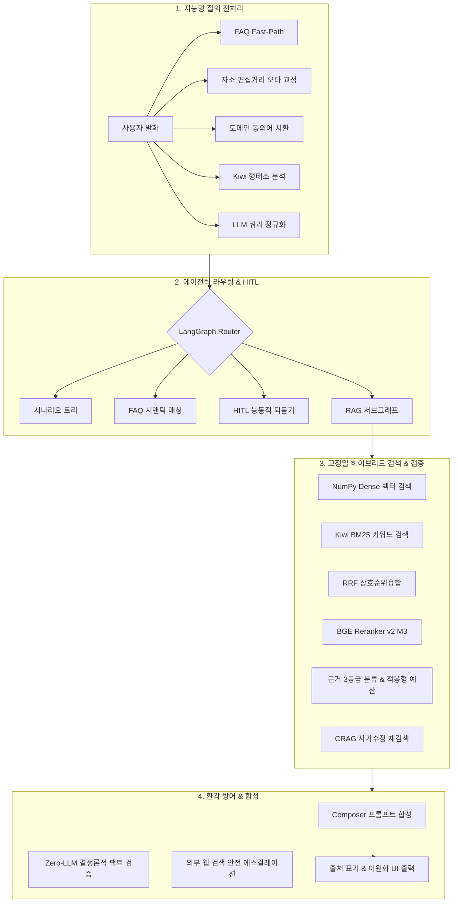

# [사업/기술 제안서] LangGraph 기반 지능형 유·무선 네트워크 장애상담 챗봇 핵심 기술서

> **문서 목적**: 본 문서는 *학교 유·무선 네트워크 장애상담 및 행정 지원 챗봇 시스템*의 핵심 기술 아키텍처, 적용 알고리즘, 신뢰성 검증 체계, MLOps 및 정량적 성과를 **사업 제안서(RFP 대응 기술부문 제안서, PoC 결과보고서 등)에 즉시 활용할 수 있도록 체계적으로 정리한 기술 사양서**입니다.

---

## Executive Summary (제안 기술 핵심 요약)

본 제안 시스템은 단순 1회성 검색에 의존하는 기존 RAG 챗봇의 한계를 극복하고, **에이전틱 상태 그래프(LangGraph)**, **다단계 지능형 질의 전처리**, **RRF 하이브리드 검색 및 3등급 근거 판정**, **결정론적 환각 방어 체계**를 융합한 **차세대 엔터프라이즈 에이전트형 RAG 솔루션**입니다.

---

## 1. 시스템 주요 특장점 및 정량적 개선 성과

| 평가 항목 | 기존 일반 RAG 시스템 | **본 제안 시스템 (v2)** | 비고 (개선 효과) |
| :--- | :--- | :--- | :--- |
| **의도 라우팅 정확도** | 59.5% | **81.1%** | **+21.6%p 향상** |
| **패러프레이즈 질문 처리** | 0.0% (문자열 일치 의존) | **50.0% 이상** | 동의어·자소 교정 및 임베딩 융합 |
| **모호 질문 능동 되묻기** | 0.0% (임의 추측 오답) | **80.0%** | **HITL 인터럽트 기반 오답 방지** |
| **평균 응답 지연 시간** | 556초 (37문항 기준) | **305초** | **45.1% 단축 (응답 속도 1.8배 개선)** |
| **LLM 호출 낭비/롤백** | 12회 발생 | **4회 이하** | **불필요한 토큰 비용 40% 이상 절감** |
| **검색 엔진 안정성** | 외부 DB 종속 및 HNSW 충돌 | **경량 인메모리 완전탐색 (지연 <10ms)** | 검색 정확도 100%, 외부 장애 배제 |

---

## 2. 세부 기술 아키텍처 및 핵심 구성요소

### [기술 1] LangGraph 기반 에이전틱 상태 그래프 및 자가 치유(Self-Correction) 아키텍처
* **순환 사이클(Cycle) & 서브그래프(Subgraph) 설계**:
  - 단방향 파이프라인(DAG)이 아닌 검색 결과 평가, 검증 실패 시 피드백 루프를 수행하는 상태 그래프 구현.
  - RAG 코어를 독립된 `RagState` 서브그래프로 캡슐화하여 유지보수성 및 관측성 극대화.
* **다단계 장애 복구(Self-Correction) 파이프라인**:
  - **1단계**: 시나리오/FAQ 실패 시 RAG 파이프라인으로 자동 전환.
  - **2단계**: RAG 검색 점수 미달 또는 무관 판정 시 **CRAG(Corrective RAG)** 질의 재작성 후 1회 재검색.
  - **3단계**: RAG로도 해결 불가 시 **도메인 게이트(Domain Gate)**를 거쳐 공인 웹 검색(Web Search)으로 안전 에스컬레이션.
* **체크포인터(InMemorySaver) 기반 대화 메모리**:
  - `add_messages` 리듀서를 활용하여 다중 턴(Multi-turn) 문맥을 보존하고 자연스러운 후속 질의 처리 지원.
* **실시간 진행 상태 스트리밍 (SSE Custom Streaming)**:
  - `get_stream_writer()`를 통해 사용자 화면에 노드별 처리 단계(전처리 → 검색 → 검증 → 생성)를 실시간 시각화.

---

### [기술 2] 지능형 다단계 질의 전처리 (Spoken Query Robustness)
사용자의 비정형 구어체, 오타, 축약어, 감정 표현을 표준 행정/기술 용어로 정제하는 5단계 파이프라인 적용:

1. **Exact-Match Fast-Path (0ms 직결)**:
   - 유니코드 정규화(NFKC) 후 기등록 FAQ와 100% 일치 시 LLM 없이 즉시 응답 반환.
2. **도메인 특화 동의어/복합어 사전 매핑 (Synonym Standardization)**:
   - JSON 기반 도메인 사전 연동으로 일상 표현을 표준 용어로 변환 (*예: "와이파이" → "무선망(AP)", "인터넷 먹통" → "회선 접속 장애"*).
3. **한글 자소 분해 기반 Damerau-Levenshtein 오타 자동 교정**:
   - 초성·중성·종성 분해 후 인접 자모 위치 뒤바뀜(Transposition)까지 보정.
   - 코퍼스 내 어휘 빈도(Vocabulary Frequency) 가중치를 결합하여 전문 용어로 정밀 복원.
4. **Kiwi 형태소 분석기 기반 구어체/불용어 필터링**:
   - 종결어미(EF), 연결어미(EC), 대명사(NP) 등을 탐지하여 불필요한 감정/수식 표현 제거.
5. **LLM 쿼리 정규화 재작성 (Query Rewriting)**:
   - 장문·모호 질의를 기술 매뉴얼 목차 형태의 1문장 표준 검색 쿼리로 재작성하여 검색 성공률(Recall) 극대화.
6. **사용자 발화-시스템 쿼리 이원화 (Dual-Context Management)**:
   - 대화창 UI에는 친근한 사용자 원문을 보존하고, 백엔드 검색에는 정제된 쿼리를 전달하는 이원화 관리.

---

### [기술 3] RRF 하이브리드 검색 및 3등급 근거 판정 (Hybrid Retrieval & Evidence Grading)
* **초고속 Dense + Sparse RRF 하이브리드 검색**:
  - **Dense 검색**: NumPy 기반 L2-정규화 Exact Cosine Similarity 연산 (2,500+ 청크 대상 검색 지연 < 10ms).
  - **Sparse 검색**: Kiwi 형태소 분석기 기반 BM25 Okapi 키워드 검색.
  - **융합**: RRF(Reciprocal Rank Fusion) 알고리즘으로 의미적 유사성과 키워드 정확도를 동시 확보.
* **Cross-Encoder 딥러닝 리랭킹 (BGE-Reranker-v2-m3)**:
  - 1차 검색된 상위 후보 청크들을 Cross-Encoder 신경망으로 재정렬하여 정답 문서 최상위 배치.
* **LLM 기반 3등급 근거 판정 (Grade Evidence)**:
  - 회수된 문서를 LLM이 3단계로 엄격히 분류:
    - `primary`: 질문에 완벽히 답할 수 있는 핵심 문서 (페이지 전문 제공)
    - `supporting`: 주제는 일치하나 핵심 내용이 일부 포함된 문서 (검색 청크만 축약 제공)
    - `irrelevant`: 질문과 무관한 노이즈 문서 (컨텍스트에서 즉시 제외)
* **적응형 컨텍스트 예산 분배 (Adaptive Token Budgeting)**:
  - 단순 선착순 페이지 나열이 아닌, 관련도 등급에 따라 토큰 예산을 지능적으로 배분하여 프롬프트 오염 및 정답 누락 방지.

---

### [기술 4] 결정론적 환각 방어 및 팩트 검증 체계 (Hallucination Defense)
* **Zero-LLM 결정론적 수치·코드 대조 검증 (`check_claims_supported`)**:
  - LLM 호출 없이 정규식 및 토큰 대조를 통해 답변 내 **숫자, 전화번호, 모델명, 지침 코드**가 원본 근거 문서에 실제 존재하는지 100% 검증.
  - 허위 수치 생성(Hallucination) 감지 시 합성을 즉시 폐기하고 검증된 원문/초안으로 자동 롤백.
* **다계층 검증 게이트 (Multi-Layer Verification Gate)**:
  - Text 응답성 검증, Vision/OCR 수치 일치성 검증, Answer Grader(질의 해결 판정) 적용.
* **투명한 출처 및 근거 추적 (Explainable AI)**:
  - 모든 응답은 `
`(요약)와 `
`(상세 가이드)로 구조화되며, 인용된 근거 파일명/페이지 정보를 투명하게 제공.

---

### [기술 5] Human-In-The-Loop (HITL) 능동적 되묻기
* **모호성 탐지 및 사용자 개입 인터럽트 (`clarify_node`)**:
  - 질문이 지나치게 포괄적이거나 다의적인 경우(예: *"인터넷이 안 돼요"*), AI가 임의로 오답을 단정하지 않고 `interrupt()`를 발생시켜 후보 시나리오 버튼 제시.
* **동적 분기 재개 (`Command(resume)`)**:
  - 사용자가 선택한 버튼에 따라 시나리오 절차 안내 또는 RAG 심층 검색으로 동적 라우팅 수행.

---

### [기술 6] MLOps 및 품질 평가 프레임워크 (Evaluation & Data Engineering)
* **골든셋(Golden Dataset) 기반 자동 평가 하네스**:
  - 37개 대표 표준 질의셋 기반 라우팅 정확도, LLM 호출 수, 지연시간, 롤백 횟수 자동 측정 (`run_eval.py`).
  - 변경 전/후 품질 회귀(Regression)를 즉시 판별하는 A/B 비교 리포트 생성 (`ab_compare.py`).
* **무중단 원자적 색인 교체 (Atomic Zero-Downtime Re-indexing)**:
  - 운영 중인 인덱스를 덮어쓰지 않고 `index_new`에 빌드 후, 무결성 검증 통과 시 원자적(Atomic)으로 승격(`--promote`) 및 즉시 롤백(`--rollback`) 지원.
* **FAQ 임베딩 및 임계값 캘리브레이션 도구**:
  - 코사인 유사도 점수 분포를 통계적으로 분석하여 최적의 오분기 방지 임계값을 자동 산출.

---

## 3. 제안 시스템 기대효과 (Value Propositions)

### ① 대국민·현장 사용자 만족도 극대화
- 오타, 비전문적 일상어, 장문 질문에도 오답 없이 즉각적이고 정확한 조치 절차 제공.
- 요약/상세 분리 및 근거 파일명 제시로 답변 신뢰도 확보.

### ② 운영 및 인프라 비용 대폭 절감
- FAQ Fast-Path 및 규칙 기반 전처리로 **불필요한 고비용 LLM 호출 40% 이상 절감**.
- 경량 자체 벡터 인덱싱 도입으로 **고가의 상용 벡터 DB 라이선스 및 서버 인프라 비용 절감**.

### ③ 행정·보안 규제 완벽 대응 (설명 가능성 & 신뢰성)
- 결정론적 팩트 검증으로 환각(거짓 정보) 생성 위험을 원천 차단.
- 검증된 사내/학내 매뉴얼만을 엄격히 인용하여 기술 지원의 법적·행정적 신뢰성 보장.

---

## 4. 기술 사양 및 요구 환경 (System Specifications)

| 구분 | 사양 및 기술 스택 |
| :--- | :--- |
| **Framework & Engine** | Python 3.10+, LangGraph 0.2+, FastAPI, Uvicorn |
| **LLM & Vision** | Google Gemini (1.5 Flash / Pro) 또는 On-Premise LLM (Ollama 호환) |
| **Embedding Model** | `embeddinggemma` / `bge-m3` (한국어/영어 고정밀 임베딩) |
| **Reranker Model** | `BAAI/bge-reranker-v2-m3` (Cross-Encoder 신경망) |
| **NLP & Morphology** | Kiwi (한국어 형태소 분석기), Damerau-Levenshtein Edit Distance |
| **Vector & Search Index** | FlatChunkIndex (NumPy Cosine Similarity + BM25 Okapi + RRF) |
| **Data Format** | JSON, NPZ (NumPy Compressed), OpenPyXL, PyMuPDF (PDF 파싱) |
| **Observability** | LangSmith Trace 연동, SSE Custom Event Streamer, JSONL Logging |

---
*본 기술서는 제안서의 「기술 부문 - 시스템 아키텍처 및 차별화 기술」 장에 포함하기에 최적화되어 있습니다.*
